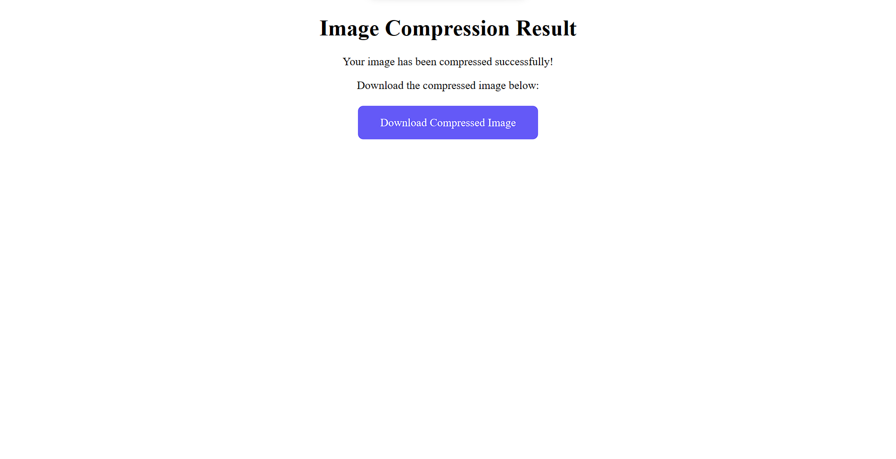

# **Image Size Compressor**

A Flask web application that compresses images to reduce file size while maintaining quality. Upload your images and specify the target file size in KB, MB, or GB.

## **Features**
- 🖼️ **Multiple Format Support**: JPG, JPEG, PNG, GIF
- 📏 **Flexible Size Targets**: Compress to specific KB, MB, or GB sizes
- 🎯 **Quality Optimization**: Iterative compression maintains best possible quality
- 🌐 **Web Interface**: Easy-to-use upload and download interface
- ⚡ **Fast Processing**: Efficient compression algorithm

## **Setup Instructions**

### **Prerequisites**
- Python 3.7 or higher
- pip (Python package installer)

### **Installation**

1. **Clone or download** the repository to your local machine

2. **Navigate to the project directory**:
   ```bash
   cd Image-size-compressor
   ```

3. **Create a virtual environment**:
   ```bash
   python -m venv venv
   ```

4. **Activate the virtual environment**:
   - **Linux/Mac**:
     ```bash
     source venv/bin/activate
     ```
   - **Windows**:
     ```bash
     venv\Scripts\activate
     ```

5. **Install required dependencies**:
   ```bash
   pip install -r requirements.txt
   ```

### **Running the Application**

1. **Start the Flask server**:
   ```bash
   python img_compressor.py
   ```

2. **Access the application**:
   - Open your web browser and go to: `http://127.0.0.1:2000`
   - The browser should automatically open to the application

3. **Using the compressor**:
   - Upload an image file (JPG, JPEG, PNG, or GIF)
   - Specify your desired file size
   - Choose the size unit (KB, MB, or GB)
   - Click compress and download your optimized image

### **Project Structure**
```
Image-size-compressor/
├── img_compressor.py      # Main Flask application
├── templates/             # HTML templates
│   ├── index.html        # Upload page
│   └── result.html       # Download page
├── static/               # Static files
│   ├── compressed/       # Compressed images output
│   └── stylesheets/      # CSS files
├── uploads/              # Temporary upload storage
├── requirements.txt      # Python dependencies
└── README.md            # This file
```


## **Screenshots**

### Index Page


### Result Page  


### Before Compression (High Quality)


### After Compression


## **Technical Details**
- **Framework**: Flask 2.2.3
- **Image Processing**: Pillow (PIL) 9.5.0
- **Compression Method**: Iterative quality reduction
- **Supported Formats**: JPG, JPEG, PNG, GIF
- **Target Sizes**: KB, MB, GB

## **Troubleshooting**

### Common Issues:
1. **Import Error**: Make sure you've activated the virtual environment
2. **Port Already in Use**: The app runs on port 2000 by default
3. **File Upload Issues**: Check that your image is in a supported format
4. **Permission Errors**: Ensure the `uploads/` and `static/compressed/` directories are writable

### Dependencies:
```
Flask == 2.2.3
Werkzeug == 2.2.3
Pillow == 9.5.0
```

<div align="center">

## Please support the development by donating.

[](https://buymeacoffee.com/aakhil)

</div>
